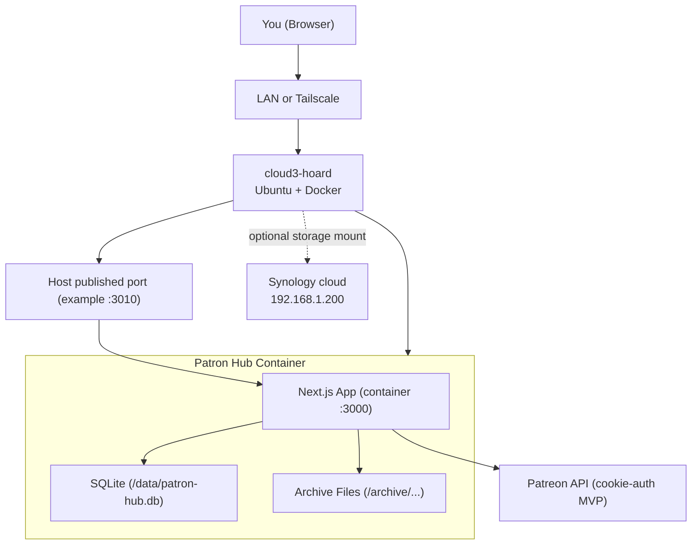

# Patron Hub Homelab Guide

This guide is tailored to your current `homelab_overview.md` values:

- Server: `cloud3-hoard` (`192.168.1.10`, Tailscale `100.111.109.23`)
- NAS: `cloud` / Synology (`192.168.1.200`, Tailscale `100.71.252.69`)
- Goal for now: LAN-first deployment, domain later

## 1. What Patron Hub Is

Patron Hub is your personal, self-hosted dashboard for paid creator content.

It does 3 core things:

1. Tracks creators/subscriptions in one UI.
2. Pulls Patreon membership/post data (MVP).
3. Archives files locally to your own storage.

## 2. Visual Map



## 3. Current Scope (What Works vs Not Yet)

Working now:

- First-run setup (`/setup`) creates admin user.
- Login/logout with session cookie auth.
- Dashboard + creator detail views.
- Manual subscription add/import JSON.
- Patreon sync MVP (`/api/sync`) with cookie-based fetch.
- Archiving:
  - Real file download when direct media URL exists.
  - Placeholder metadata file when direct URL is unavailable.

Not complete yet:

- Full adapters for Substack/Gumroad/Discord.
- Background scheduler/queue.
- Multi-user admin features.
- Public internet hardening beyond basic setup.

## 4. Install on Your Server (LAN-first)

Run these on `cloud3-hoard`.

```bash
git clone https://github.com/alexmgee/patron-hub.git
cd patron-hub
mkdir -p server-data server-archive
PATRON_HUB_HTTP_PORT=3010 docker compose -f docker-compose.yml -f docker-compose.lan.yml up -d --build
```

Open:

- LAN: `http://192.168.1.10:3010`
- Tailscale: `http://100.111.109.23:3010`

How to “open” one of these URLs:

1. On your Mac (or any device on your home Wi-Fi), open a web browser (Chrome/Safari).
2. Click the address bar at the top (where it shows a website address).
3. Type `http://192.168.1.10:3010` and press Enter.

First-time setup:

1. Visit `/setup`
2. Create admin email + password
3. Login at `/login`

Optional no-login mode (trusted LAN only):

1. Create or edit a file named `.env` in `~/patron-hub` on the server.
2. Add this line: `PATRON_HUB_DISABLE_AUTH=1`
3. Restart Patron Hub (commands below).

If `PATRON_HUB_DISABLE_AUTH=1` is enabled:

- You do not need `/setup` or `/login`
- Anyone on your LAN (or Tailscale) can open the app, so treat it as trusted-network only

## 5. Daily Operations

From `~/patron-hub` on server:

```bash
# Make sure you're in the repo folder
cd ~/patron-hub

# Start / update
PATRON_HUB_HTTP_PORT=3010 docker compose -f docker-compose.yml -f docker-compose.lan.yml up -d --build

# Stop
PATRON_HUB_HTTP_PORT=3010 docker compose -f docker-compose.yml -f docker-compose.lan.yml down

# Check status
PATRON_HUB_HTTP_PORT=3010 docker compose -f docker-compose.yml -f docker-compose.lan.yml ps

# Follow logs
PATRON_HUB_HTTP_PORT=3010 docker compose -f docker-compose.yml -f docker-compose.lan.yml logs -f patron-hub
```

## 6. Patreon Sync Setup

Recommended (works best for huge cookie strings): set the cookie in `.env` on the server.

1. On `cloud3-hoard`, open your `.env`:

```bash
cd ~/patron-hub
nano .env
```

2. Add (or update) this line (one line, no quotes):

```bash
PATRON_HUB_PATREON_COOKIE=PASTE_THE_FULL_COOKIE_HEADER_VALUE_HERE
```

3. Restart Patron Hub:

```bash
PATRON_HUB_HTTP_PORT=3010 docker compose -f docker-compose.yml -f docker-compose.lan.yml up -d --build
```

4. In the web UI, click `Sync` on the dashboard.

Notes:

- The cookie must be the raw **Cookie** header value and must be copied fully. If your cookie contains a “…” character, it will fail.
- Optional backlog depth tuning (more history, slower sync): set `PATRON_HUB_PATREON_MAX_PAGES` in `.env` (default `40`).
- Optional resolver queue tuning:
  - `PATRON_HUB_PATREON_HARVEST_JOB_LIMIT` (default `80`)
  - `PATRON_HUB_PATREON_HARVEST_MAX_ATTEMPTS` (default `8`)

Easy way to wipe just the cookie line in `.env` (Ubuntu):

```bash
cd ~/patron-hub
sed -i 's/^PATRON_HUB_PATREON_COOKIE=.*/PATRON_HUB_PATREON_COOKIE=/' .env
```

## 6.1 What Sync Does (And How To “Harvest” Backlog)

When you click `Sync`, Patron Hub:

1. Reads your Patreon memberships and creates “Subscriptions” in the app.
2. For each subscription, fetches post history (how far back depends on `PATRON_HUB_PATREON_MAX_PAGES`).
3. Creates “Content Items” for each post.
4. If a post has a direct downloadable URL and `Auto-download enabled` is on, it downloads the file into the archive.
5. If a post does not have a direct URL, Patron Hub queues a “resolver job” and tries:
   - Patreon post API details
   - Patreon post HTML extraction
   - (For HLS video playlists like `.m3u8`) downloads via `ffmpeg`

Where your downloaded files end up:

- On the server host: `~/patron-hub/server-archive/`
- Inside the container: `/archive/`

If you want to pull a bigger backlog:

- Increase `PATRON_HUB_PATREON_MAX_PAGES` in `.env` (example: `120`)
- Restart Patron Hub
- Click `Sync` again

## 7. Homelab Hookup Checklist

Check these are true:

1. Patron Hub reachable on `http://192.168.1.10:3010`.
2. Container is running (`docker compose ... ps` shows `patron-hub` up).
3. `server-data` has `patron-hub.db`.
4. `server-archive` has creator/platform folders after archiving.
5. If using NAS storage for app data, your target path is mounted and writable before starting Compose.

## 8. Storage Layout

Inside host repo folder:

- `server-data/` -> SQLite + app data
- `server-archive/` -> archived content files

Inside app archive tree:

`{platform}/{creatorSlug}/{YYYY-MM}/{content-title}/{file}`

Example:

`patreon/blender-guru-12345/2026-02/some-post-title/video.mp4`

## 9. Public Domain Later

When you buy a domain:

1. Configure DNS `A` record to your public IP.
2. Set `.env` values (`PATRON_HUB_DOMAIN`, `PATRON_HUB_EMAIL`, Caddy basic auth creds).
3. Use Caddy compose overlay:
   - `docker compose -f docker-compose.yml -f docker-compose.caddy.yml up -d --build`

Keep Tailscale as a fallback path regardless of public DNS.

## 10. Glossary

- `LAN`: Your local network at home (e.g., `192.168.1.x`).
- `Tailscale`: Private mesh VPN that gives each device a stable private IP.
- `CGNAT`: ISP network setup that often blocks inbound port-forwarding.
- `Reverse proxy`: Front service (like Caddy) that accepts internet traffic and forwards to app container.
- `SQLite`: Single-file database used by Patron Hub.
- `Archive root`: Folder where downloaded/archived content is stored.
- `Compose overlay`: Second compose file layered on base compose (`-f file1 -f file2`).
- `Patreon cookie`: Browser session credential used by MVP sync adapter.
- `Auto-sync`: Global/subscription toggle that allows sync actions.
- `Auto-download`: Download media automatically when direct URLs are available.
