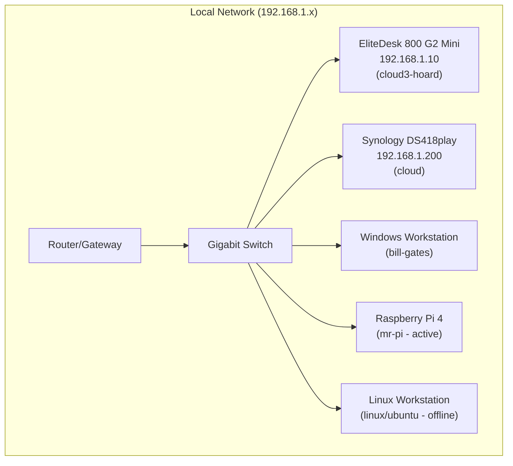

# Homelab Documentation

> **Last Updated:** 2026-02-11  
> **Status:** Active - Synology NAS expanding (4th drive syncing) + Patron Hub LAN deployment documented

---

## Infrastructure Overview



---

## Hardware Inventory

### Primary Server: HP EliteDesk 800 G2 Mini
| Property | Value |
|----------|-------|
| **Hostname** | cloud3-hoard |
| **IP Address** | 192.168.1.10 (static) |
| **OS** | Ubuntu Server 24.04.3 LTS |
| **RAM** | 16GB |
| **Username** | macgregor |

### NAS: Synology DS418play
| Property | Value |
|----------|-------|
| **Hostname** | cloud |
| **IP Address** | 192.168.1.200 |
| **Tailscale IP** | 100.71.252.69 |
| **Bays** | 4 |
| **Current Drives** | 4× drives (Drive 4 syncing to storage pool) |
| **Usable Capacity** | ~25TB (19TB used, 6.3TB free) |
| **Status** | 🔄 **EXPANDING** (Drive 4 syncing, ~1 day remaining) |

#### NAS Shares
| Share Name | Purpose | Mount Point (EliteDesk) |
|------------|---------|------------------------|
| CLOUD | Main storage | /media/CLOUD |
| backup_docker | Docker backups | /media/Docker-Backup |
| backup_elitedesk | System backups | /media/EliteDesk-Backup |

#### Media Directory Structure
```
/media/CLOUD/Media/
├── Movies/        # 297+ items, Jellyfin-compatible naming
├── TV Shows/      # Television series
├── Music/         # Audio library
├── Photos/        # Image collection
└── Documents/     # Misc documents
```

### Windows Workstation
| Storage | Size |
|---------|------|
| OS NVMe | 4TB |
| NVMe Drive 2 | 2TB |
| NVMe Drive 3 | 2TB |
| HDD 1 | 18TB |
| HDD 2 | 14TB |

### Additional Hardware
- Raspberry Pi 4 - Planned for Pi-hole/network services
- Raspberry Pi 5 - Planned for testing/development
- IOGEAR 4-port KVM USB3.1 DisplayPort switch
- 2× External USB 3.0 enclosures
- Multiple spare HDDs and SATA SSDs

---

## Active Services

| Service | Host | Port | Status | URL (Local) | URL (Tailscale) |
|---------|------|------|--------|-------------|-----------------|
| **Patron Hub** | EliteDesk | 3000 | 🧪 LAN (documented/ready) | `http://192.168.1.10:3000` | `http://100.111.109.23:3000` |
| **Portainer** | EliteDesk | 9000 | ✅ Running | `http://192.168.1.10:9000` | `http://100.111.109.23:9000` |
| **Jellyfin** | EliteDesk | 8096 | ✅ Running (HW Transcode) | `http://192.168.1.10:8096` | `http://100.111.109.23:8096` |
| **FileBrowser** | EliteDesk | 8080 | ✅ Running | `http://192.168.1.10:8080` | `http://100.111.109.23:8080` |
| **Heimdall** | EliteDesk | 80/443 | ✅ Running | `http://192.168.1.10` | `http://100.111.109.23` |
| **Nextcloud** | EliteDesk | 8443 | ✅ Running | `https://192.168.1.10:8443` | `https://100.111.109.23:8443` |
| **qBittorrent** | EliteDesk | 8081 | 🔒 VPN (Mullvad) | `http://192.168.1.10:8081` | `http://100.111.109.23:8081` |
| **Sonarr** (TV) | EliteDesk | 8989 | ✅ Running | `http://192.168.1.10:8989` | `http://100.111.109.23:8989` |
| **Radarr** (Movies) | EliteDesk | 7878 | ✅ Running | `http://192.168.1.10:7878` | `http://100.111.109.23:7878` |
| **Prowlarr** | EliteDesk | 9696 | ✅ Running | `http://192.168.1.10:9696` | `http://100.111.109.23:9696` |
| **Jellyseerr** | EliteDesk | 5055 | ✅ Running | `http://192.168.1.10:5055` | `http://100.111.109.23:5055` |
| **DSM** | Synology | 5000 | ✅ Running | `http://192.168.1.200:5000` | `http://100.71.252.69:5000` |
| **SSH** | EliteDesk | 22 | ✅ Running | `ssh macgregor@192.168.1.10` | `ssh macgregor@100.111.109.23` |

### Jellyfin Libraries
| Library | Content Type | Path (Container) |
|---------|--------------|------------------|
| Movies | Movies | `/media/Media/Movies` |
| Television | TV Shows | `/media/Media/TV Shows` |
| Audio | Music | `/media/Media/Music` |

### Remote Access (Tailscale)
- **Status:** ✅ Active
- **Nodes:**
  - `cloud3-hoard` (EliteDesk): `100.111.109.23`
  - `cloud` (Synology): `100.71.252.69`
  - `ipad163`: `100.118.195.81`
  - `the-macbook-pro-1`: `100.111.104.79`
  - `bill-gates` (PC Windows): [IP TBD]
  - `linux` / `ubuntu` (PC Linux): `100.126.217.4` (Offline)
  - `mr-pi` (Raspberry Pi): `100.109.92.11`
- **Admin Console:** https://login.tailscale.com/admin/machines

### Patron Hub Notes
- **Repo:** `https://github.com/alexmgee/patron-hub`
- **Deployment Docs:** `DEPLOYMENT.md` and `HOMELAB_PATRON_HUB_GUIDE.md`
- **Compose (LAN):** `docker compose -f docker-compose.yml -f docker-compose.lan.yml up -d --build`
- **Storage Paths (host bind mounts):**
  - `./server-data` → `/data` (SQLite)
  - `./server-archive` → `/archive` (downloaded files)

---

## Completed Setup Items

- [x] FileBrowser (port 8080)
- [x] Nextcloud (port 8443)
- [x] Heimdall dashboard (port 80/443)
- [x] Tailscale VPN
- [x] Automated backups (daily at 03:00)
- [x] Sonarr/Radarr
- [x] Jellyfin with media libraries configured
- [x] Media folder reorganization (Movies, TV Shows, Music, Photos)
- [x] Nautilus sidebar bookmarks for NAS shares
- [x] Patron Hub deployment runbook + homelab documentation wiring

### Planned (Future)
- [ ] Pi-hole on Raspberry Pi 4
- [ ] Grafana + Prometheus monitoring
- [ ] Home Assistant
- [ ] Traefik reverse proxy
- [ ] Vaultwarden
- [ ] VLAN segmentation
- [ ] Kubernetes cluster
- [ ] Offsite backup
- [ ] UPS with NUT monitoring

---

## NFS Mount Configuration

Current `/etc/fstab` entries on EliteDesk:

```bash
192.168.1.200:/volume1/CLOUD /media/CLOUD nfs defaults,auto,nofail,noatime,user,x-gvfs-show,x-gvfs-name=Synology-CLOUD 0 0
192.168.1.200:/volume1/backup_docker /media/Docker-Backup nfs defaults,auto,nofail,noatime,user,x-gvfs-show,x-gvfs-name=Docker-Backup 0 0
192.168.1.200:/volume1/backup_elitedesk /media/EliteDesk-Backup nfs defaults,auto,nofail,noatime,user,x-gvfs-show,x-gvfs-name=EliteDesk-Backup 0 0
```

---

## 🛡️ Backup Configuration
- **Strategy:** Daily Config Backup (Docker volumes)
- **Destination:** `/media/EliteDesk-Backup` (Synology NAS)
- **Schedule:** Daily at 03:00
- **Latest Status:** Verified ✅

## Resolved Issues

1. ~~**Ubuntu Files app sidebar** - NFS mounts don't show in Nautilus sidebar~~ → Fixed: Added bookmarks to `~/.config/gtk-3.0/bookmarks`
2. **SMB authentication** - Fails with Synology; using NFS instead (better performance anyway)
3. ~~**Media organization** - Needs reorganization into Jellyfin-friendly structure~~ → Fixed: Reorganized into Movies, TV Shows, Music, Photos
4. ~~**Synology Storage Pool Degraded**~~ → Resolved: 4 drives now active, Drive 4 syncing to pool
